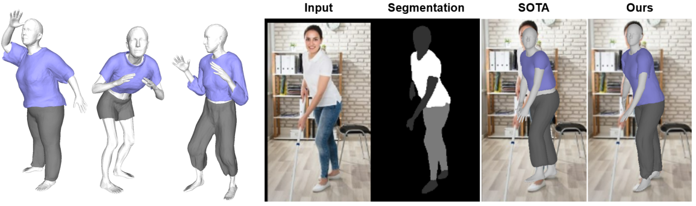

# DIG: Draping Implicit Garment over the Human Body
<p align="center"></p>
This is the repo for ["DIG: Draping Implicit Garment over the Human Body"](https://arxiv.org/abs/2209.10845).

Here we provide the code and the pretrained models to generate garments and drape them on the posed human body.

## Pre-requisites
The code is implemented with python 3.6 and torch 1.9.0+cu102 (other versions may also work).

Download the female SMPL model from http://smplify.is.tue.mpg.de/ and place `basicModel_f_lbs_10_207_0_v1.0.0.pkl` in the folder of `./smpl_pytorch`.

Other dependencies include `trimesh`, `torchgeometry`, `scikit-image`.

## To run
In `infer.py` you can find the script for inference. It loads the pretrained SDF models and skinning models (which are placed in `./extra-data/pretrained`), reconstructs garments using the learned latent codes and deforms them with the given SMPL parameters `/extra-data/pose-beta-sample.pt`. You can simply run
```
python infer.py
```

To generate results for other garments and bodies, you can replace the latent code and SMPL parameters with other values.

Check [here](https://github.com/liren2515/DIG/tree/main/models) for the instruction of training.

## Citation
If you find this work helpful for your research, please cite
```
@article{li2022dig, 
  title={DIG: Draping Implicit Garment over the Human Body},
  author={Li, Ren and Guillard, Benoit and Remelli, Edoardo and Fua, Pascal}
  journal={arXiv preprint arXiv:2209.10845},
  year={2022}
}
```
